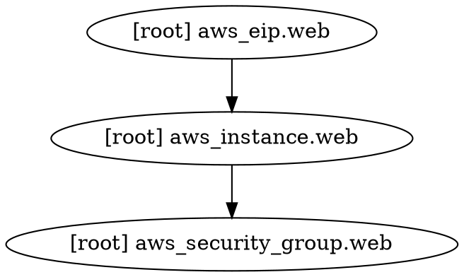

<!-- Space: harukaaibarapublic -->
<!-- Parent: 13_Stateの検査と修正 -->
<!-- Title: terraform graph -->

# terraform graph

「なぜかこのリソースが先に作られてしまう」「apply が遅い原因がわからない」——リソース間の依存関係を把握したいときに使う。`terraform graph` はリソースの依存グラフを DOT 形式で出力する。

---

## 基本的な使い方

```bash
# DOT 形式のテキストを出力
terraform graph

# Graphviz で画像に変換（要インストール）
terraform graph | dot -Tpng -o graph.png
terraform graph | dot -Tsvg -o graph.svg
```

```bash
# macOS で Graphviz をインストール
brew install graphviz
```

---

## 出力例



矢印の向きが依存関係を示す。`aws_security_group` → `aws_instance` → `aws_eip` の順で作られる。

---

## 実務での使い所

- **apply が遅い**：依存が直列になっているリソースが多すぎる場合、並列化できる箇所を探す
- **予期しない順序で作成される**：参照を確認して依存関係が正しいか検証する
- **大規模な構成の全体把握**：どのリソースが他の多くのリソースに依存されているか一目でわかる

大規模な構成では出力が複雑になりすぎるので、特定のモジュールに絞って使うと読みやすい。
