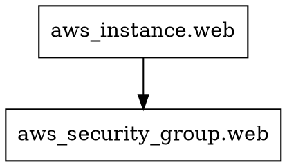

<!-- Space: harukaaibarapublic -->
<!-- Parent: 13_Stateの検査と修正 -->
<!-- Title: terraform graph -->

# terraform graph

リソース間の依存関係を DOT 形式で出力するコマンド。グラフとして可視化できる。

---

## 基本的な使い方

```bash
terraform graph
```

DOT 言語形式のテキストが出力される。



---

## Graphviz で画像に変換

```bash
# Graphviz をインストール
brew install graphviz  # macOS

# PNG に変換
terraform graph | dot -Tpng -o graph.png

# SVG に変換（テキスト検索が効く）
terraform graph | dot -Tsvg -o graph.svg
```

---

## 用途

- 意図しない依存関係の可視化
- デプロイ順序の確認
- 大規模な構成の全体把握

実務では plan が遅い・エラーが起きる原因を調査するときに使う。大規模な構成では出力が複雑になりすぎて読みにくいため、特定のモジュールに絞って使うことが多い。
