### 関連ドキュメント
https://docs.aws.amazon.com/toolkit-for-vscode/latest/userguide/s3-service.html
https://docs.aws.amazon.com/toolkit-for-vscode/latest/userguide/s3-service-objects.html

### AWS Toolkit for Visual Studio Code（VS Code用AWSツールキット）とは？（AIで生成）
Visual Studio Code内でAmazon S3のオブジェクトやリソースを操作できるようにする拡張機能です。

S3リソースバケットに保存されているファイル、フォルダ、その他のデータはS3オブジェクトと呼ばれます。

このツールキットを使用することで、VS Codeから直接、S3バケットの表示、管理、編集 や、S3オブジェクト（ファイルやフォルダなど）の操作 が可能になります。

具体的には、AWS Toolkit for Visual Studio Codeを利用することで、ローカルに保存されたファイルをAmazon S3バケットにアップロードしたり、リモートのAmazon S3オブジェクトをローカルシステムにダウンロードしたり することができます。

さらに、リモートのAmazon S3オブジェクトをその場で編集することも可能です。

S3オブジェクトのパスをコピーしたり、署名付きURLを生成してプライベートなS3オブジェクトを一時的に共有したりする機能 も備わっています。

また、不要になったS3オブジェクトを削除することもできます。

S3リソースに関しても、AWS Toolkit for Visual Studio CodeからS3バケットの作成、S3バケットへのフォルダの追加、そしてS3バケット自体の削除 といった操作が可能です。

### とりあえず触ってみる
デフォルトプロファイルで利用

1. インストール: VS Codeの拡張機能からAWS Toolkitをインストールします。

2. AWSマークからの画面遷移: インストール後、サイドバーのAWSマークから画面に遷移します。

3. 「EXPLORER」を押す
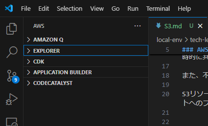
4. 「S3」を押す

5. バケットマークを押下することで S3 バケットを作成できる

6. バケット名（Bucket Name）を入れる
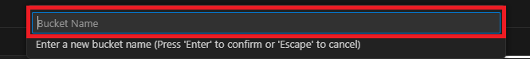
7. バケットが作成された
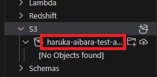
8. ファイルアップロード（Upload Files）
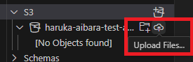
9. 「test.txt」をアップロードできた
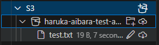
コンソールからも確認
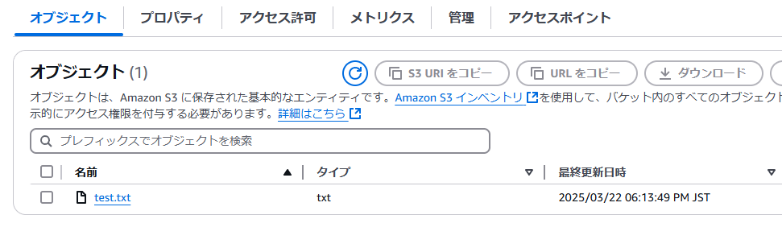
10. ファイルの内容を表示　オブジェクトを押下すると Read-Only で表示できました

文字を入力しようとすると「Editor is read-only ～」と表示されます。
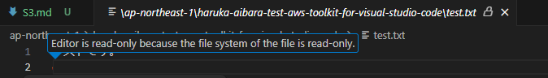
11. ファイルを編集してみる（Edit File）
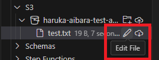
VS Code 上で編集可能になり、保存すると S3 バケットにアップロードされます

12. ファイルを削除してみる
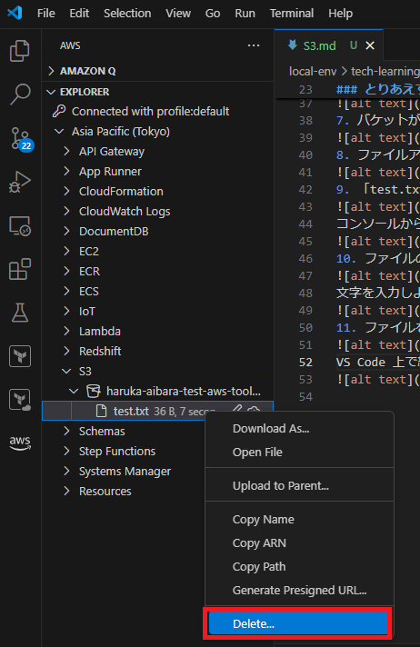
警告が表示されました。今回は削除して問題ないため「Delete」を押下しました

13. ファイルが削除されました（No Objects foundになっています）
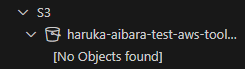
14. バケットを削除してみる

確認のためバケット名の入力を求められます
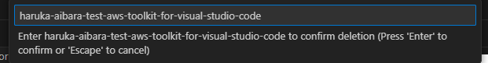
15. バケットが削除されました
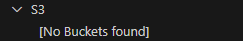
