## サブタスクのストーリーポイントの合計をエピックに表示したかった理由

バックログでは各タスクの合計が表示されますが、エピック単位で確認したかった。

標準機能では見つからなかったため、JIRA Automationを利用して実現できそうであるため調査・実装をした。

## 成功した手法

参考記事:

https://community.atlassian.com/t5/Automation-questions/How-sum-up-story-point-estimate-in-Epic-from-stories-and-others/qaq-p/2204699

1. ルールを作成

2. フィールド値の変更時
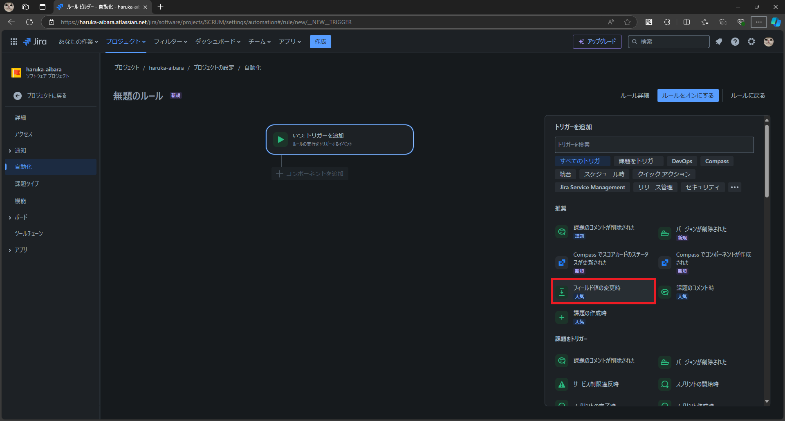

3. 変化を監視するためのフィールド - Story point estimate
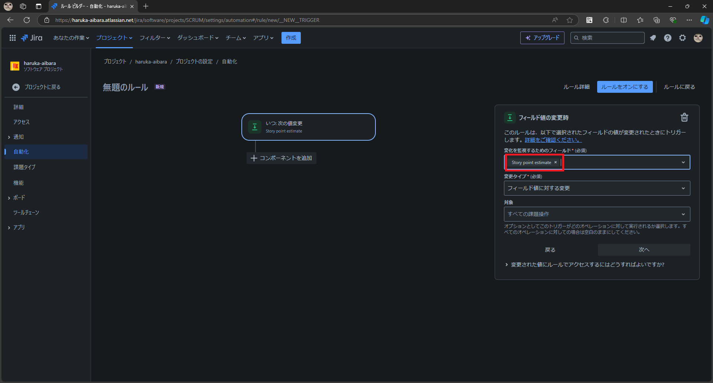

4. 次へ
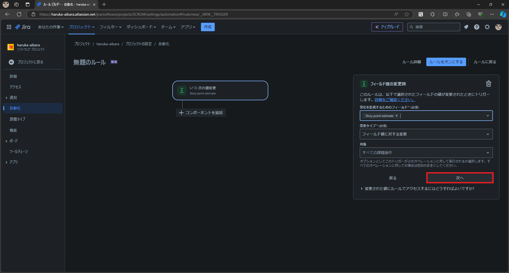

5. IF: 条件を追加
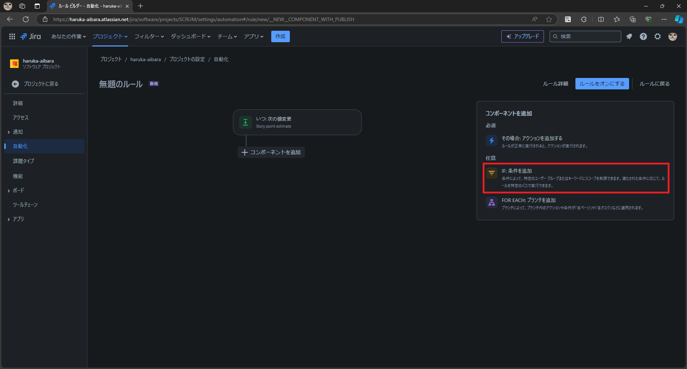

6. 課題フィールドの条件
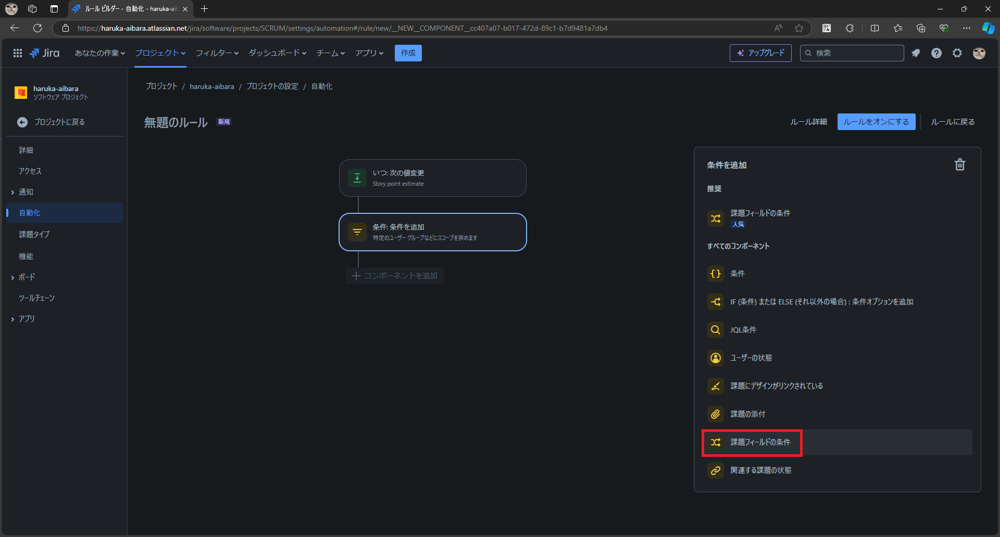

7. フィールド: 課題タイプ 条件: と等しい 値: タスク

8. 次へ
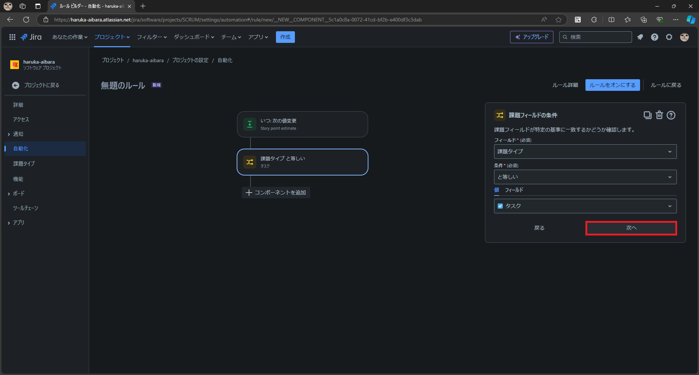

9. その場合: アクションを追加する
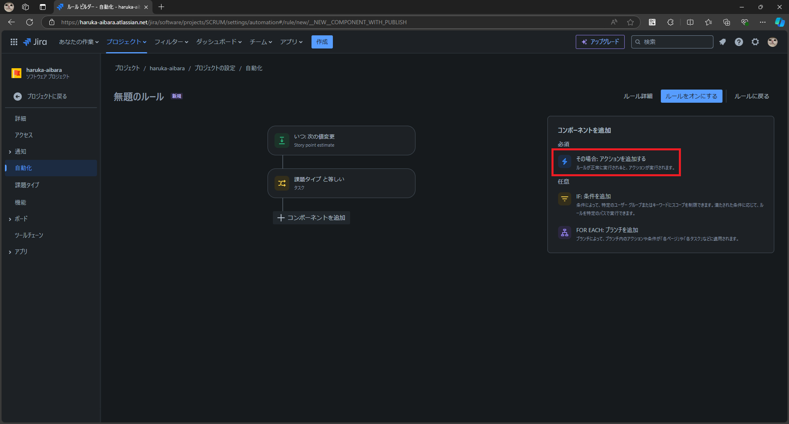

10. 課題を検索

11. JQL - project = yourProjectName AND parent = {{triggerIssue.parent.key}}
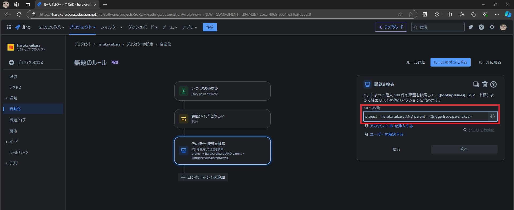

## 備忘のため、過去の失敗した履歴を下記に残しておきます。

失敗した理由：
JIRAにはチーム管理対象プロジェクトと企業管理対象プロジェクトがあります。

https://support.atlassian.com/ja/jira-software-cloud/docs/what-are-team-managed-and-company-managed-projects/

私が利用していたのはチーム管理対象プロジェクトのものです。

検索してよく出てくる「Story Points」のフィールドは、
企業管理対象プロジェクトのJIRAでのみ存在するもので、それを用いる下記の手法ではできませんでした。

その後、チーム管理対象プロジェクトに存在する「Story point estimate」フィールドを活用する上述の「成功した手法」で、実現できました。

### 失敗した手順
JIRA Automation を使います。

備忘のための記録として、画像と簡単なメモだけ貼付していきます。

最後までやった結果、Story Points というフィールドがなく実現できていない。

参考記事

https://www.ricksoft.jp/blog/articles/001550.html

1. ツアーをスキップ

2. フィールド値の変更時

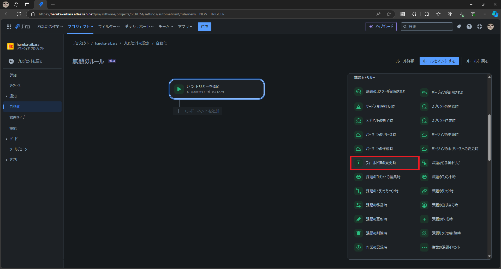

3. Story Points

4. 次へ
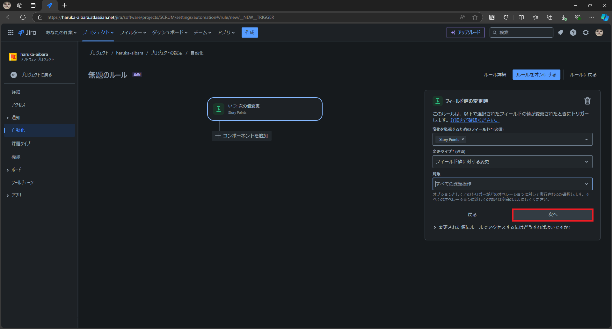

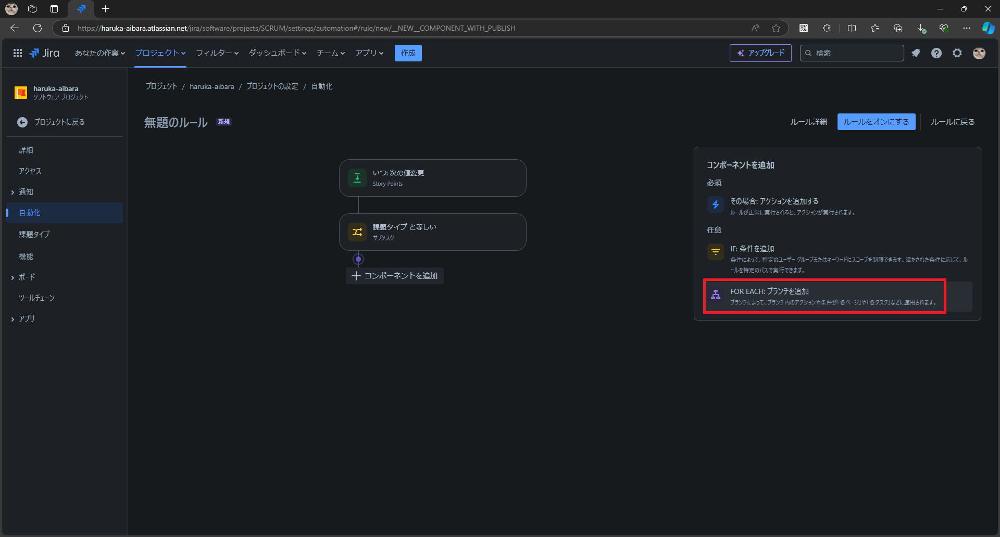

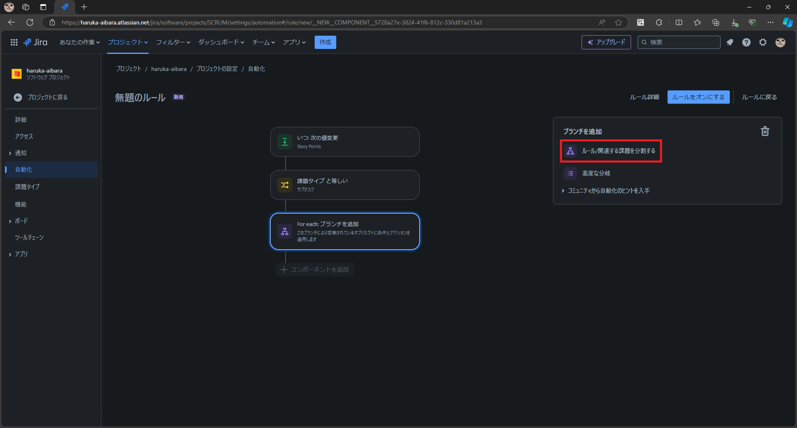

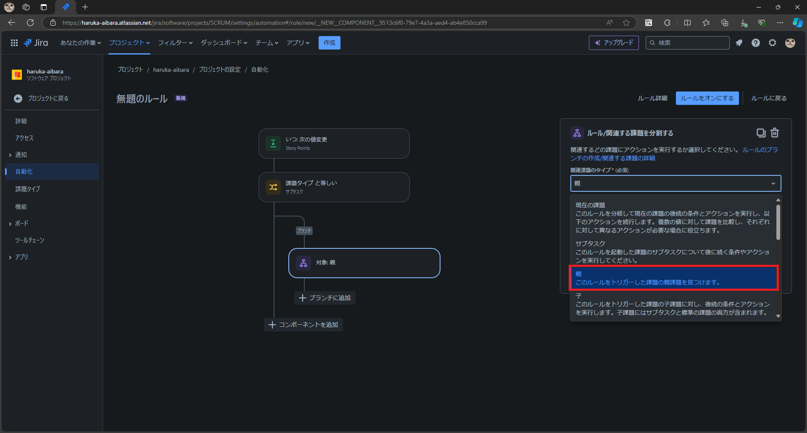

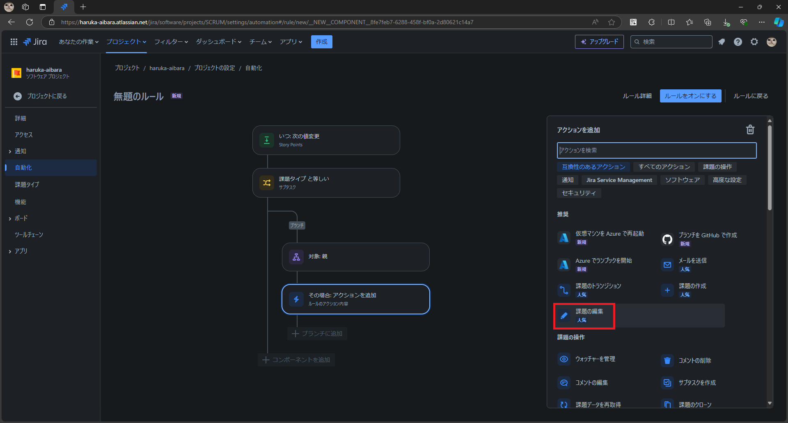

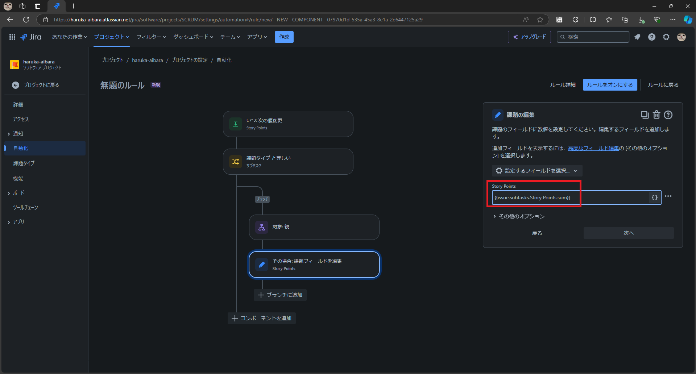

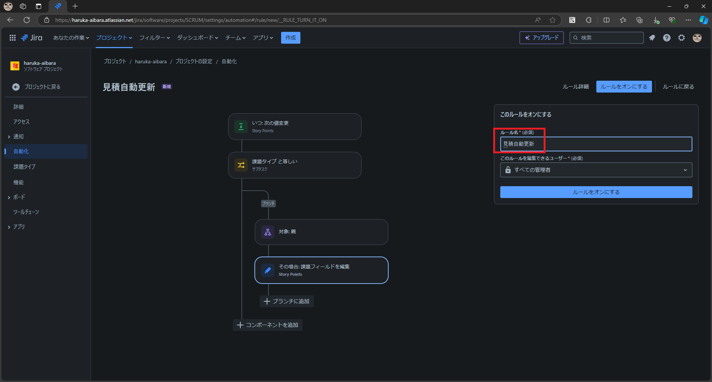

完了

