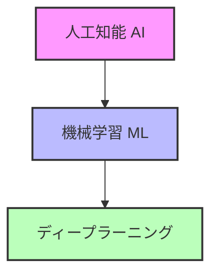

# AIと機械学習の基礎

## 概要
人工知能（AI）と機械学習（ML）は、コンピュータが人間のように学習し、判断するための技術です。これらの技術は、私たちの生活を便利にする様々なサービスで使われています。

## 主要な用語の説明
- **人工知能（AI）**: 人間の知能をまねたコンピュータの技術
  - 例：スマートフォンの音声アシスタント
  - 例：自動運転車
- **機械学習（ML）**: AIの一種で、データから学習する技術
  - 例：スパムメールの自動判別
  - 例：商品のおすすめ
- **ディープラーニング**: 機械学習の一種で、より複雑な学習ができる技術
  - 例：画像認識
  - 例：音声認識

## 技術の関係

## 身近な例
- **スマートフォン**
  - 顔認証
  - 音声アシスタント
  - 写真の自動分類
- **インターネット**
  - 検索エンジン
  - 翻訳サービス
  - 商品のおすすめ
- **家電製品**
  - スマートスピーカー
  - 自動掃除機
  - スマート冷蔵庫

## 学習の仕組み
1. データを集める
   - 例：猫の写真を集める
   - 例：会話のデータを集める
2. データから学習する
   - 例：猫の特徴を覚える
   - 例：会話のパターンを覚える
3. 新しいデータで判断する
   - 例：新しい写真が猫かどうか判断
   - 例：新しい会話に応答する

## よくある質問

### Q: AIは人間の仕事を奪うの？
A: そうではありません。AIは：
- 人間の仕事をサポートする道具
- 新しい仕事を作り出す可能性がある
- 人間と協力して使うもの

### Q: AIを学ぶのは難しい？
A: 基本的な考え方から始めれば、誰でも学べます：
- まずは身近な例から理解する
- 少しずつ知識を増やす
- 実際に使ってみる

## 参考資料
- [Google AI Education](https://ai.google/education/)
- [Microsoft AI School](https://aischool.microsoft.com/)
- [IBM AI Learning](https://www.ibm.com/training/ai) 
