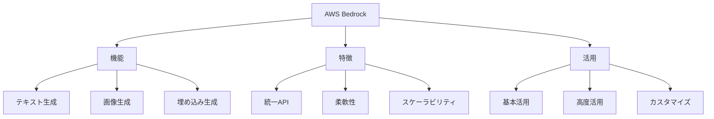

# AWS Bedrock入門

AWS Bedrockは、様々なAIモデルを簡単に利用できるAWSのサービスです。例えば、Claude、Titan、Llama 2など、異なるベンダーのモデルを同じインターフェースで利用でき、モデルの切り替えも簡単に行えます。

## 1. AWS Bedrockって何？

### 基本的な仕組み
- 単一のAPIで複数モデルを利用
- 例：Claude、Titan、Llama 2
- 例：Stable Diffusion、Cohere
- モデルの切り替えが容易

### 利用可能なモデル
- テキスト生成モデル
- 画像生成モデル
- 埋め込み生成モデル

### 特徴
- 統一されたAPI
- 柔軟なモデル選択
- スケーラビリティ

## 2. 主な機能

### モデル呼び出し
- テキスト生成
- 画像生成
- 埋め込み生成

### モデル管理
- モデルの選択
- パラメータの設定
- 使用量の監視

### セキュリティ
- アクセス制御
- データの暗号化
- コンプライアンス対応

## 3. AWS Bedrockの特徴

## 4. 実務での活用法

### 基本的な活用
- テキスト生成
- 画像生成
- 埋め込み生成

### 高度な活用
- マルチモデル連携
- カスタムモデル
- エンタープライズ利用

## 5. よくある質問

### Q: どのモデルを選べばいい？
A: 以下の点で判断します：
- タスクの種類
- コスト
- 性能要件

### Q: どんなことができる？
A: 以下のようなことができます：
- テキストの生成
- 画像の作成
- データの分析

## 6. 始め方

### 1. 基本的な考え方を学ぶ
- AWS Bedrockの基本
- 使い方の基本
- 身近な例

### 2. 簡単な例で試す
- 基本的な生成
- 単純な処理
- 基本的な応用

### 3. 少しずつ難しい問題に挑戦
- 複雑な生成
- 高度な処理
- 実践的な活用

## 参考資料
- [Google Machine Learning Crash Course](https://developers.google.com/machine-learning/crash-course)
- [Microsoft Learn: Machine Learning](https://docs.microsoft.com/learn/paths/get-started-with-artificial-intelligence-on-azure/)
- [Kaggle Learn](https://www.kaggle.com/learn)
