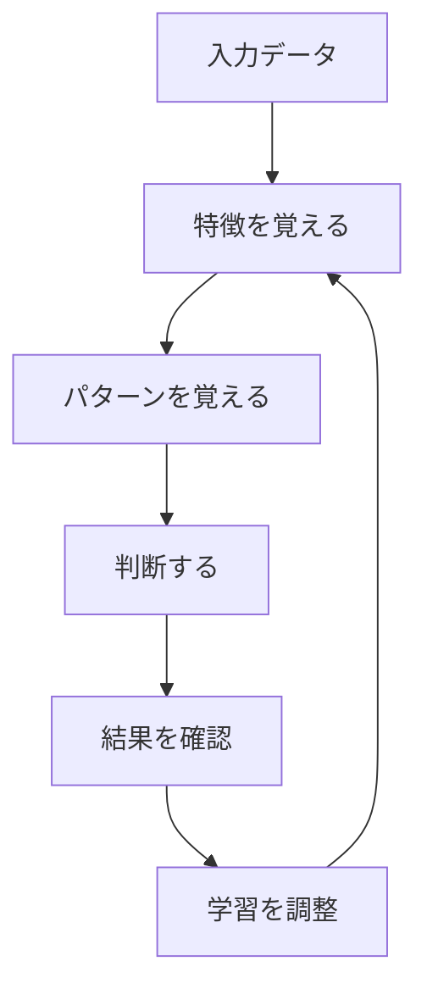

# ディープラーニングの基礎

ディープラーニングは、人間の脳の仕組みを参考にした学習方法です。例えば、私たちが猫の写真を見て「これは猫だ」と判断できるように、コンピュータも似たような仕組みで学習します。

## 1. ディープラーニングって何？

### 基本的な仕組み
- 脳の神経細胞をまねた「ニューロン」を使う
- たくさんの層（レイヤー）を重ねて学習する
- 例：写真を見て「これは猫だ」と判断する

### 従来の機械学習との違い
- 特徴を自動で見つけられる
- より複雑な問題を解ける
- 例：猫の耳の形やしっぽの長さを自動で覚える

## 2. 主な使い方

### 1. 画像認識
- 写真から物を判別する
- 例：猫の写真を判別
- 例：文字認識
- 例：顔認識

### 2. 音声認識
- 音声を文字に変換する
- 例：スマートスピーカー
- 例：音声メモ
- 例：会議の文字起こし

### 3. 自然言語処理
- 文章を理解する
- 例：翻訳
- 例：チャットボット
- 例：文章要約

## 3. 学習の流れ

## 4. 身近な例

### スマートフォン
- 顔認証
- 音声アシスタント
- 写真の自動分類

### インターネット
- 翻訳サービス
- 検索エンジン
- 商品のおすすめ

### 家電製品
- スマートスピーカー
- 自動掃除機
- スマート冷蔵庫

## 5. よくある質問

### Q: ディープラーニングは難しい？
A: 基本的な考え方から始めれば、誰でも理解できます：
- まずは身近な例から学ぶ
- 少しずつ知識を増やす
- 実際に使ってみる

### Q: どれくらいのデータが必要？
A: 問題の複雑さによりますが：
- 簡単な問題：数百枚の写真
- 複雑な問題：数千枚以上の写真

## 6. 始め方

### 1. 基本的な考え方を学ぶ
- ニューロンの仕組み
- 学習の流れ
- 身近な例

### 2. 簡単な例で試す
- 画像認識
- 音声認識
- 文章理解

### 3. 少しずつ難しい問題に挑戦
- 複雑な画像認識
- 自然な会話
- 高度な翻訳

## 参考資料
- [Google AI Education](https://ai.google/education/)
- [Microsoft Learn: Deep Learning](https://docs.microsoft.com/learn/paths/get-started-with-artificial-intelligence-on-azure/)
- [TensorFlow Tutorials](https://www.tensorflow.org/tutorials)
