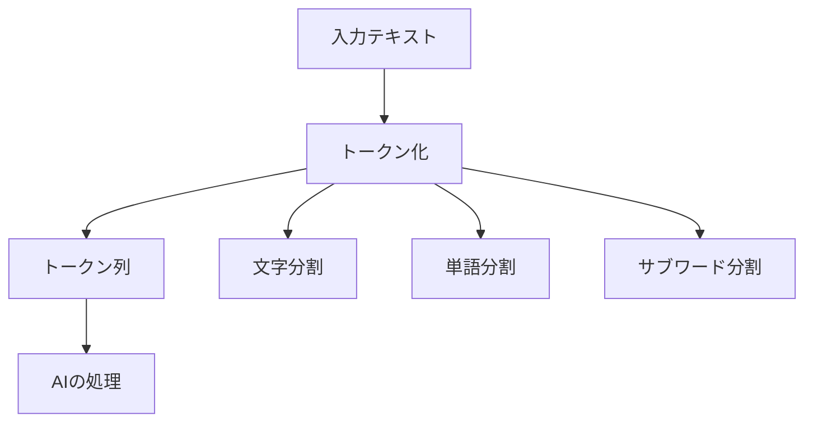

# トークン化の基礎

トークンは、AIがテキストを理解するための基本的な単位です。例えば、「こんにちは」という日本語は「こ」「ん」「に」「ち」「は」というトークンに分解され、AIはこれらのトークンを個別に処理します。

## 1. トークンって何？

### 基本的な仕組み
- テキストを小さな単位に分割する方法
- 例：単語、文字、サブワード
- 例：「Hello」→「H」「e」「l」「l」「o」

### 分割の方法
- 文字単位
- 単語単位
- サブワード単位

### 言語による違い
- 日本語：基本的に1文字が1トークン
  - 例：「猫」→「猫」（1トークン）
  - 例：「こんにちは」→「こ」「ん」「に」「ち」「は」（5トークン）
- 英語：文字や単語単位で分割
  - 例：「cat」→「c」「a」「t」または「cat」（1トークン）

## 2. トークン化の種類

### 文字ベース
- 1文字ずつ分割
- 例：「猫」→「猫」
- 例：「dog」→「d」「o」「g」

### 単語ベース
- 単語単位で分割
- 例：「I love cats」→「I」「love」「cats」
- 例：「私は猫が好き」→「私」「は」「猫」「が」「好き」

### サブワードベース
- 単語をさらに細かく分割
- 例：「playing」→「play」「ing」
- 例：「食べる」→「食」「べる」

## 3. トークン化の流れ

## 4. 実務での活用法

### テキスト処理
- 自然言語処理
- 機械翻訳
- テキスト生成

### モデル設計
- 入力層の設計
- 埋め込み層の設定
- 出力層の調整

## 5. よくある質問

### Q: トークン数はどうやって決めるの？
A: 以下の要素を考慮します：
- 言語の特性
- 処理の目的
- リソースの制約

### Q: トークン化の方法はどう選ぶ？
A: 以下の点で判断します：
- 言語の種類
- 処理の目的
- パフォーマンス要件

## 6. 始め方

### 1. 基本的な考え方を学ぶ
- トークン化の基本
- 言語の特性
- 身近な例

### 2. 簡単な例で試す
- 基本的なトークン化
- 言語による違い
- 基本的な応用

### 3. 少しずつ難しい問題に挑戦
- 複雑なトークン化
- 高度な応用
- 実践的な活用

## 参考資料
- [Google Machine Learning Crash Course](https://developers.google.com/machine-learning/crash-course)
- [Microsoft Learn: Machine Learning](https://docs.microsoft.com/learn/paths/get-started-with-artificial-intelligence-on-azure/)
- [Kaggle Learn](https://www.kaggle.com/learn) 
