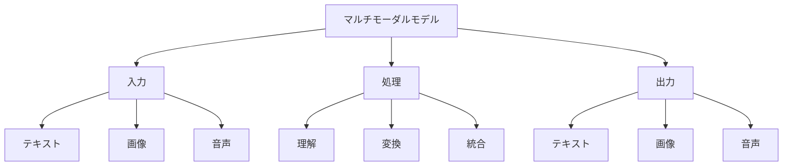

# マルチモーダルモデル入門

マルチモーダルモデルは、テキスト、画像、音声など複数の形式のデータを同時に処理できるAIモデルです。例えば、GPT-4VやClaude 3、Geminiなどがマルチモーダルモデルの代表例で、これらは画像を見ながら説明を生成したり、音声を理解して応答したりすることができます。

## 1. マルチモーダルモデルって何？

### 基本的な仕組み
- 複数のデータ形式を同時に処理
- 例：テキストと画像
- 例：音声とテキスト
- 異なる形式のデータを統合して理解

### 処理できるデータ
- テキスト（文章）
- 画像（写真やイラスト）
- 音声（会話や音楽）
- 動画（映像）

### 特徴
- 複数形式の理解
- 形式間の変換
- 統合的な分析

## 2. 主な種類

### テキスト・画像モデル
- 画像の説明生成
- 例：写真の説明
- 例：イラストの解説

### テキスト・音声モデル
- 音声認識と応答
- 例：会話の文字起こし
- 例：音声による指示

### 統合型モデル
- 複数形式の同時処理
- 例：画像と音声の理解
- 例：動画の分析

## 3. マルチモーダルモデルの特徴

## 4. 実務での活用法

### 基本的な活用
- 画像の説明生成
- 音声認識と応答
- マルチメディア分析

### 高度な活用
- コンテンツ生成
- 異常検知
- 意思決定支援

## 5. よくある質問

### Q: マルチモーダルモデルはどう選べばいい？
A: 以下の点で判断します：
- 必要なデータ形式
- 処理能力
- コスト

### Q: どんなことができる？
A: 以下のようなことができます：
- 画像の説明
- 音声の文字起こし
- 複数形式の理解

## 6. 始め方

### 1. 基本的な考え方を学ぶ
- マルチモーダルの基本
- 使い方の基本
- 身近な例

### 2. 簡単な例で試す
- 基本的な処理
- 単純な変換
- 基本的な応用

### 3. 少しずつ難しい問題に挑戦
- 複雑な処理
- 高度な変換
- 実践的な活用

## 参考資料
- [Google Machine Learning Crash Course](https://developers.google.com/machine-learning/crash-course)
- [Microsoft Learn: Machine Learning](https://docs.microsoft.com/learn/paths/get-started-with-artificial-intelligence-on-azure/)
- [Kaggle Learn](https://www.kaggle.com/learn) 
