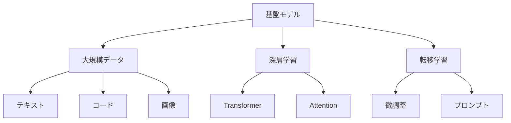

# 基盤モデル入門

基盤モデルは、様々なタスクに対応できる大規模なAIモデルです。例えば、GPTやBERT、Claudeなどが基盤モデルの代表例で、これらは文章の理解から生成まで、幅広い能力を持っています。

## 1. 基盤モデルって何？

### 基本的な仕組み
- 大量のデータで学習した大規模モデル
- 例：GPT-4、Claude、BERT
- 例：PaLM、LLaMA、Mistral

### 特徴
- 汎用的な能力
- 転移学習が可能
- 多様なタスクに対応

## 2. 主な種類

### 言語モデル
- 文章の理解と生成
- 例：GPTシリーズ
- 例：Claude

### マルチモーダルモデル
- テキストと画像の処理
- 例：GPT-4V
- 例：Claude 3

### コード生成モデル
- プログラミング言語の理解
- 例：CodeLlama
- 例：Codex

## 3. 基盤モデルの特徴

## 4. 実務での活用法

### 基本的な活用
- テキスト生成
- 文章要約
- 質問応答

### 高度な活用
- コード生成
- 画像理解
- マルチモーダル処理

## 5. よくある質問

### Q: 基盤モデルはどう選べばいい？
A: 以下の点で判断します：
- タスクの種類
- リソースの制約
- コストの考慮

### Q: 独自のモデルを作るべき？
A: 以下の場合に検討します：
- 特殊な要件がある
- データの制約がある
- コスト効率を重視

## 6. 始め方

### 1. 基本的な考え方を学ぶ
- 基盤モデルの基本
- 使い方の基本
- 身近な例

### 2. 簡単な例で試す
- 基本的な活用
- プロンプトの作成
- 基本的な応用

### 3. 少しずつ難しい問題に挑戦
- 複雑な活用
- 高度な応用
- 実践的な活用

## 参考資料
- [Google Machine Learning Crash Course](https://developers.google.com/machine-learning/crash-course)
- [Microsoft Learn: Machine Learning](https://docs.microsoft.com/learn/paths/get-started-with-artificial-intelligence-on-azure/)
- [Kaggle Learn](https://www.kaggle.com/learn) 
