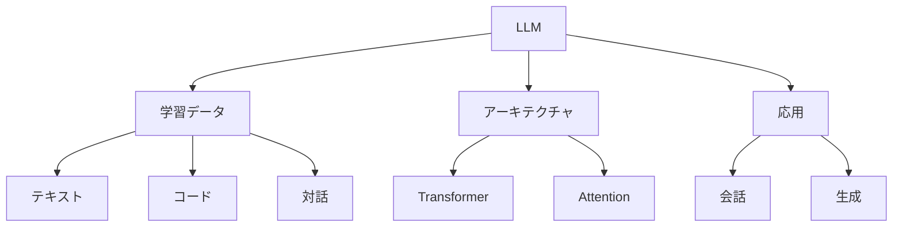

# 大規模言語モデル入門

大規模言語モデル（LLM）は、大量のテキストデータを学習した大規模なAIモデルです。例えば、ChatGPTやClaude、GeminiなどがLLMの代表例で、これらは人間のような自然な会話や文章生成が可能です。

## 1. LLMって何？

### 基本的な仕組み
- 大量のテキストデータで学習
- 例：GPT-4、Claude、Gemini
- 例：LLaMA、Mistral、PaLM
- 次の単語の予測を繰り返して文章を生成

### 単語予測の例
- 入力：「今日は」
- 予測：「良い天気ですね」（最も確率の高い続き）
- 他の可能性：「雨が降っています」「忙しい一日でした」など

### 特徴
- 自然な文章生成
- 文脈の理解
- 多言語対応

## 2. 主な種類

### 会話型LLM
- チャット形式での対話
- 例：ChatGPT
- 例：Claude

### 生成型LLM
- 文章の生成と編集
- 例：GPT-4
- 例：Gemini

### 専門特化型LLM
- 特定分野に特化
- 例：CodeLlama（プログラミング）
- 例：Med-PaLM（医療）

## 3. LLMの特徴

## 4. 実務での活用法

### 基本的な活用
- チャットボット
- 文章生成
- 要約・翻訳

### 高度な活用
- コード生成
- データ分析
- 意思決定支援

## 5. よくある質問

### Q: LLMはどう選べばいい？
A: 以下の点で判断します：
- 用途（会話/生成/分析）
- 言語対応
- コストと性能

### Q: 独自のLLMを作るべき？
A: 以下の場合に検討します：
- 特殊な要件がある
- データの制約がある
- コスト効率を重視

## 6. 始め方

### 1. 基本的な考え方を学ぶ
- LLMの基本
- 使い方の基本
- 身近な例

### 2. 簡単な例で試す
- 基本的な会話
- 文章生成
- 基本的な応用

### 3. 少しずつ難しい問題に挑戦
- 複雑な会話
- 高度な生成
- 実践的な活用

## 参考資料
- [Google Machine Learning Crash Course](https://developers.google.com/machine-learning/crash-course)
- [Microsoft Learn: Machine Learning](https://docs.microsoft.com/learn/paths/get-started-with-artificial-intelligence-on-azure/)
- [Kaggle Learn](https://www.kaggle.com/learn)
