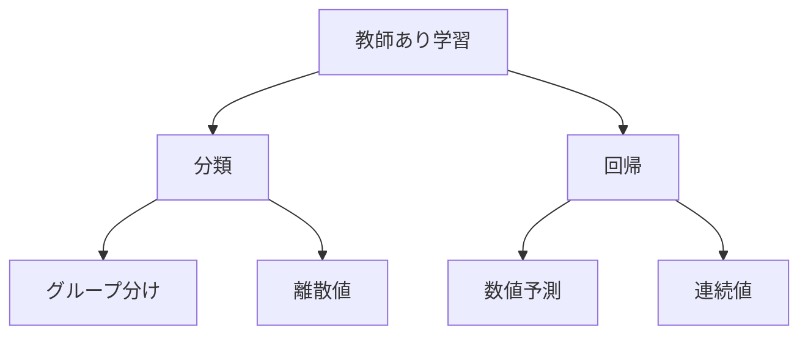

# 教師あり学習の種類

教師あり学習には、大きく分けて2つの種類があります。一つは「分類」で、もう一つは「回帰」です。例えば、メールを「スパムかどうか」に分けるのが分類で、「明日の気温」を予測するのが回帰です。

## 1. 分類（Classification）

### どんなことができる？
- データをグループに分ける
- 例：スパムメールを見分ける
- 例：病気の診断をする
- 例：画像に写っているものを判別する

### 主な種類
1. 2クラス分類
   - 2つのグループに分ける
   - 例：スパム/非スパム
   - 例：病気/健康

2. 多クラス分類
   - 3つ以上のグループに分ける
   - 例：猫/犬/鳥
   - 例：晴れ/曇り/雨

3. マルチラベル分類
   - 複数のラベルを付ける
   - 例：画像に「猫」と「室内」のラベル
   - 例：文章に複数のトピック

## 2. 回帰（Regression）

### どんなことができる？
- 数値を予測する
- 例：来月の売上を予測
- 例：家の価格を予測
- 例：気温を予測

### 主な種類
1. 線形回帰
   - 直線で予測
   - 例：広告費と売上の関係
   - 例：勉強時間とテストの点数

2. 多項式回帰
   - 曲線で予測
   - 例：気温の変化
   - 例：株価の推移

3. リッジ回帰/ラッソ回帰
   - 過学習を防ぐ
   - 例：複雑な関係の予測
   - 例：ノイズの多いデータ

## 3. 分類と回帰の比較

## 4. よくある質問

### Q: 分類と回帰、どちらを選べばいい？
A: 以下の点で判断します：
- 出力がグループか数値か
- 予測したいものの性質
- 必要な精度のレベル

### Q: 機械学習を始めるには？
A: 以下の順序で学ぶと良いでしょう：
1. 基本的な考え方を理解する
2. 簡単な例で試してみる
3. 少しずつ難しい問題に挑戦する

## 5. 始め方

### 1. 基本的な考え方を学ぶ
- 分類と回帰の違い
- 使い方の基本
- 身近な例

### 2. 簡単な例で試す
- スパムメールの判別
- 気温の予測
- 画像の分類

### 3. 少しずつ難しい問題に挑戦
- 複雑な分類問題
- 高度な予測問題
- 複合的な問題

## 参考資料
- [Google Machine Learning Crash Course](https://developers.google.com/machine-learning/crash-course)
- [Microsoft Learn: Machine Learning](https://docs.microsoft.com/learn/paths/get-started-with-artificial-intelligence-on-azure/)
- [Kaggle Learn](https://www.kaggle.com/learn)
