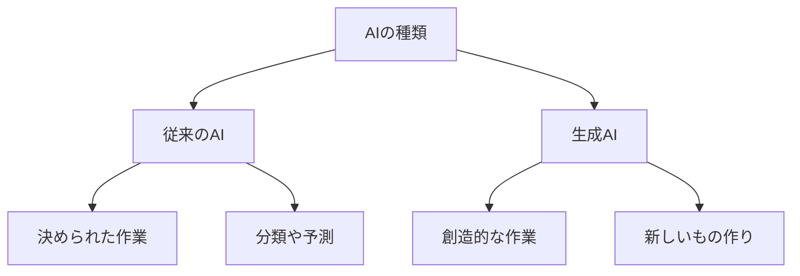
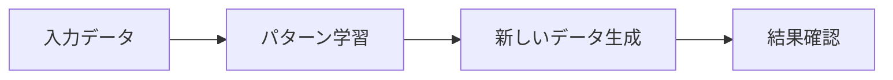

# 生成AIの応用

生成AIは、文章を書いたり、絵を描いたり、音楽を作ったりできるAIです。まるでクリエイターのように、新しいコンテンツを作り出すことができます。

## 1. 生成AIって何？

### 基本的な仕組み
- 大量のデータから学ぶ
- 例：たくさんの猫の写真を見て、新しい猫の絵を描く
- 例：たくさんの文章を読んで、新しい文章を書く

### 従来のAIとの違い

## 2. 主な種類と使い方

### 大規模言語モデル（LLM）
- 文章の生成
- 例：チャットボット
- 例：文章の要約

### 画像生成AI
- イラストの作成
- 例：風景画の生成
- 例：人物画の生成

### 音声生成AI
- 音声の合成
- 例：声の変換
- 例：音楽の生成

## 3. 生成の流れ

## 4. 実際の使い方

### ビジネスでの活用
- マーケティング文書の作成
- 商品画像の生成
- カスタマーサポート

### クリエイティブ分野
- イラスト制作
- 音楽制作
- デザイン作成

### 教育・研究
- 教材の作成
- 研究データの生成
- シミュレーション

## 5. よくある質問

### Q: 生成AIは仕事を奪うの？
A: そうではありません。むしろ：
- 作業の効率化
- 新しい仕事の創出
- 人間の創造性の拡張

### Q: 生成AIの出力は信頼できる？
A: 以下の点に注意が必要です：
- 事実確認が必要
- 品質チェックが重要
- 人間の監修が不可欠

## 6. 始め方

### 1. 基本的な考え方を学ぶ
- 生成AIの基本
- 使い方の基本
- 身近な例

### 2. 簡単な例で試す
- 文章生成
- 画像生成
- 音声生成

### 3. 少しずつ難しい問題に挑戦
- 複雑な生成
- 高度な応用
- 実践的な活用

## 参考資料
- [Google Machine Learning Crash Course](https://developers.google.com/machine-learning/crash-course)
- [Microsoft Learn: Machine Learning](https://docs.microsoft.com/learn/paths/get-started-with-artificial-intelligence-on-azure/)
- [Kaggle Learn](https://www.kaggle.com/learn)
