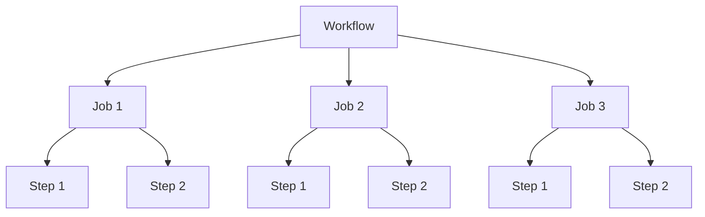

# GitHub Actions: Workflows, Jobs, Steps

GitHub Actionsは、コードの自動化、テスト、デプロイを簡単に実現できるCI/CDプラットフォームで、ソフトウェア開発のワークフローを効率化します。

Workflowは「いつ」「何を」実行するかを定義し、Jobsは並列または順次に実行される処理のグループ、Stepsは各Jobの中で順番に実行される最小単位の処理です。



## 目次
1. [Workflowの基本](#workflowの基本)
2. [Jobsの詳細](#jobsの詳細)
3. [Stepsの構成](#stepsの構成)
4. [実践的な例](#実践的な例)

## Workflowの基本

Workflowは、リポジトリの`.github/workflows`ディレクトリに配置されるYAMLファイルで定義します。

### トリガー

Workflowを実行するきっかけとなるイベントを指定します。

```yaml
on:
  push:
    branches: [ main ]
  pull_request:
    branches: [ main ]
  schedule:
    - cron: '0 0 * * *'  # 毎日午前0時に実行
```

### 基本構造

```yaml
name: CI/CD Workflow

on:
  push:
    branches: [ main ]

jobs:
  build:
    runs-on: ubuntu-latest
    steps:
      - uses: actions/checkout@v3
      - name: ビルド処理
        run: npm install && npm run build
```

## Jobsの詳細

Jobsは、Workflowの中で独立して実行される処理のまとまりです。

### Jobs間の依存関係

```yaml
jobs:
  test:
    runs-on: ubuntu-latest
    steps:
      - name: テスト実行
        run: npm test

  build:
    needs: test  # testジョブが成功した場合のみ実行
    runs-on: ubuntu-latest
    steps:
      - name: ビルド処理
        run: npm build
```

### 実行環境の指定

```yaml
jobs:
  build:
    runs-on: ubuntu-latest  # Ubuntu環境で実行
    # または
    # runs-on: windows-latest  # Windows環境で実行
    # runs-on: macos-latest  # macOS環境で実行
```

### マトリックスビルド

複数の環境やバージョンでの実行を簡単に定義できます。

```yaml
jobs:
  test:
    runs-on: ${{ matrix.os }}
    strategy:
      matrix:
        os: [ubuntu-latest, windows-latest]
        node-version: [14.x, 16.x, 18.x]
    steps:
      - uses: actions/checkout@v3
      - name: Node.js ${{ matrix.node-version }} セットアップ
        uses: actions/setup-node@v3
        with:
          node-version: ${{ matrix.node-version }}
      - run: npm test
```

## Stepsの構成

Stepsは、Jobの中で順番に実行される個々のタスクです。

### アクション使用

既存のアクションを利用する場合：

```yaml
steps:
  - name: リポジトリのチェックアウト
    uses: actions/checkout@v3
  
  - name: Node.jsセットアップ
    uses: actions/setup-node@v3
    with:
      node-version: '16'
```

### コマンド実行

シェルコマンドを直接実行する場合：

```yaml
steps:
  - name: 依存関係のインストール
    run: npm install
  
  - name: テスト実行
    run: npm test
  
  - name: 複数行のコマンド
    run: |
      echo "最初のコマンド"
      echo "次のコマンド"
      npm run build
```

### 環境変数

```yaml
jobs:
  build:
    runs-on: ubuntu-latest
    env:
      NODE_ENV: production  # ジョブレベルの環境変数
    steps:
      - name: ステップごとの環境変数
        env:
          DEBUG: true
        run: echo $DEBUG
```

### 条件付き実行

```yaml
steps:
  - name: 特定の条件での実行
    if: github.event_name == 'push'
    run: echo "プッシュイベントで実行されました"
```

## 実践的な例

以下は、Nodeアプリケーションのテスト、ビルド、デプロイを行う完全なワークフロー例です：

```yaml
name: Node.js CI/CD

on:
  push:
    branches: [ main ]
  pull_request:
    branches: [ main ]

jobs:
  test:
    runs-on: ubuntu-latest
    steps:
      - uses: actions/checkout@v3
      - name: Node.jsセットアップ
        uses: actions/setup-node@v3
        with:
          node-version: '16'
      - name: 依存関係のインストール
        run: npm ci
      - name: テスト実行
        run: npm test

  build:
    needs: test
    runs-on: ubuntu-latest
    steps:
      - uses: actions/checkout@v3
      - name: Node.jsセットアップ
        uses: actions/setup-node@v3
        with:
          node-version: '16'
      - name: 依存関係のインストール
        run: npm ci
      - name: ビルド
        run: npm run build
      - name: ビルド成果物の保存
        uses: actions/upload-artifact@v3
        with:
          name: build-files
          path: ./dist

  deploy:
    needs: build
    if: github.ref == 'refs/heads/main'  # mainブランチの場合のみデプロイ
    runs-on: ubuntu-latest
    steps:
      - name: ビルド成果物のダウンロード
        uses: actions/download-artifact@v3
        with:
          name: build-files
          path: ./dist
      - name: デプロイ処理
        run: |
          echo "実際のデプロイコマンドをここに記述"
```

GitHub ActionsのWorkflows、Jobs、Stepsの階層構造を理解することで、効率的で柔軟な自動化パイプラインを構築できます。
