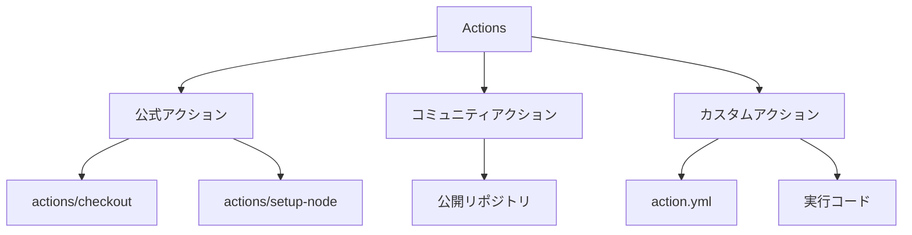

# GitHub Actions 講義: YAML "actions"について

## 概要
GitHub Actionsは、コードリポジトリでの自動化ワークフローを実現するためのCI/CDプラットフォームであり、YAMLファイルによって定義されます。

## YAML "actions"とは
YAML "actions"とは、GitHub Actions内で再利用可能な実行単位として定義された処理で、ワークフロー内のジョブやステップから呼び出して使用できるコンポーネントです。



## 基本構造
Actionsは以下の形式でYAMLファイルで定義され、`.github/workflows`ディレクトリに配置されます：

```yaml
name: ワークフロー名

on:
  event1:
  event2:
  
jobs:
  job_id:
    runs-on: ubuntu-latest
    steps:
      - name: ステップ名
        uses: actions/checkout@v2
      
      - name: カスタムアクションの実行
        uses: owner/repo-name@ref
        with:
          param1: value1
          param2: value2
```

## actionsの種類

GitHub Actionsには主に3種類のactionがあります：

1. **公式アクション**: GitHubが提供する公式のアクション（例：`actions/checkout@v2`）
2. **コミュニティアクション**: コミュニティによって作成・共有されているアクション
3. **カスタムアクション**: 自分で作成したアクション

## アクションの参照方法

YAMLファイル内でアクションを参照する方法は以下の通りです：

- `uses: actions/checkout@v2`：GitHubが提供する公式アクション
- `uses: owner/repo-name@ref`：公開リポジトリのアクション
- `uses: ./.github/actions/my-action`：同じリポジトリ内のアクション

## パラメータの渡し方

アクションにパラメータを渡す場合は、`with`キーワードを使用します：

```yaml
- name: アクションを実行
  uses: actions/hello-world-javascript-action@v1
  with:
    who-to-greet: '初めてのアクション'
```

## アクションの作成方法

カスタムアクションを作成するには、以下のファイルが必要です：

1. **action.yml**: アクションのメタデータを定義
2. **実行コード**: JavaScriptまたはDockerコンテナ

**action.yml**の基本構造：
```yaml
name: 'アクション名'
description: 'アクションの説明'
inputs:
  input-name:
    description: '入力の説明'
    required: true
    default: 'デフォルト値'
outputs:
  output-name:
    description: '出力の説明'
runs:
  using: 'node16'
  main: 'index.js'
```

## 主な使用例

1. **コードのチェックアウト**:
```yaml
- uses: actions/checkout@v2
```

2. **Node.jsセットアップ**:
```yaml
- uses: actions/setup-node@v2
  with:
    node-version: '14'
```

3. **ビルドとデプロイ**:
```yaml
- name: デプロイ
  uses: owner/deploy-action@v1
  with:
    target: 'production'
```

## まとめ
GitHub ActionsのYAML "actions"は、再利用可能な処理を定義し、ワークフロー内で組み合わせることで、コードのテスト、ビルド、デプロイなどの自動化を実現する強力なツールです。
