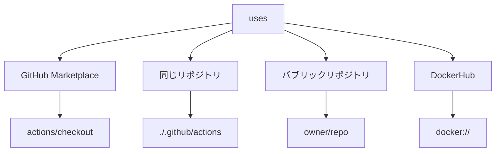

# GitHub Actionsの「uses」

## 概要
GitHubアクションワークフローで事前定義されたアクションを再利用するための`uses`キーワードについて解説します。

## 理論
`uses`キーワードは、公開リポジトリや同じリポジトリ内の再利用可能なコードを参照し、ワークフローに組み込むための機能です。



## uses構文の基本

```yaml
steps:
  - name: ステップ名
    uses: アクション名@バージョン
```

## usesの利用方法

### 1. GitHubマーケットプレイスのアクションを利用

```yaml
steps:
  - name: チェックアウト
    uses: actions/checkout@v4
    
  - name: Node.jsセットアップ
    uses: actions/setup-node@v3
    with:
      node-version: '18'
```

### 2. 同じリポジトリ内のアクションを利用

```yaml
steps:
  - name: カスタムアクション実行
    uses: ./.github/actions/my-action
```

### 3. 他のパブリックリポジトリのアクションを利用

```yaml
steps:
  - name: 他リポジトリのアクション
    uses: owner/repo-name@ref
```

### 4. DockerHubのコンテナを利用

```yaml
steps:
  - name: Dockerコンテナアクション
    uses: docker://alpine:3.16
```

## バージョン指定方法

```yaml
# 特定バージョン
uses: actions/setup-node@v3

# メジャーバージョンの最新
uses: actions/setup-node@v3

# マイナーバージョンの最新
uses: actions/setup-node@v3.4

# 特定のコミットSHA
uses: actions/setup-node@1abc234

# ブランチ名
uses: actions/setup-node@main
```

## 注意点

- 特定のバージョンをピン留めすることで再現性を確保できます
- セキュリティ上の理由から、信頼できるアクションを使用しましょう
- `with`パラメータと組み合わせてアクションに入力を渡せます
- バージョンを指定しない場合は将来的な変更で壊れる可能性があります

## 応用例

```yaml
name: CI/CD パイプライン

on:
  push:
    branches: [ main ]

jobs:
  build:
    runs-on: ubuntu-latest
    steps:
      - name: コードのチェックアウト
        uses: actions/checkout@v4
      
      - name: Node.jsセットアップ
        uses: actions/setup-node@v3
        with:
          node-version: '18'
          cache: 'npm'
      
      - name: 依存関係のインストール
        run: npm ci
      
      - name: ビルド
        run: npm run build
      
      - name: テスト
        run: npm test
      
      - name: AWSにデプロイ
        uses: aws-actions/configure-aws-credentials@v1
        with:
          aws-access-key-id: ${{ secrets.AWS_ACCESS_KEY_ID }}
          aws-secret-access-key: ${{ secrets.AWS_SECRET_ACCESS_KEY }}
          aws-region: ap-northeast-1
```

## まとめ
`uses`キーワードは、GitHub Actionsの重要な機能であり、共有可能なアクションを活用することでワークフローの構築を効率化できます。バージョン管理に注意し、信頼できるアクションを選択することが重要です。
