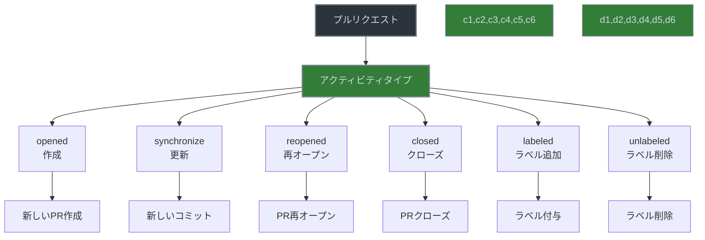

# GitHub Actions のアクティビティタイプの使い方



> 詳細は[公式ドキュメント: Events that trigger workflows](https://docs.github.com/en/actions/using-workflows/events-that-trigger-workflows)を参照してください。

GitHub Actions のアクティビティタイプは、特定のイベントが発生した際にワークフローをトリガーする条件を細かく制御するための重要な機能です。

## アクティビティタイプとは

アクティビティタイプは、イベントが発生した際の具体的なアクションの種類を指定することで、ワークフローをより細かく制御することができます。例えば、`pull_request` イベントの場合、デフォルトでは `opened`、`synchronize`、`reopened` の3つのアクティビティタイプのみがトリガーとなります。

## 主なアクティビティタイプの例

### プルリクエスト関連
```yaml
on:
  pull_request:
    types:
      - opened      # 新しいプルリクエストが作成された時
      - synchronize # プルリクエストに新しいコミットがプッシュされた時
      - reopened    # クローズされたプルリクエストが再オープンされた時
      - closed      # プルリクエストがクローズされた時
      - labeled     # プルリクエストにラベルが追加された時
      - unlabeled   # プルリクエストからラベルが削除された時
```

### イシュー関連
```yaml
on:
  issues:
    types:
      - opened     # 新しいイシューが作成された時
      - edited     # イシューが編集された時
      - deleted    # イシューが削除された時
      - transferred # イシューが別のリポジトリに転送された時
      - labeled    # イシューにラベルが追加された時
      - unlabeled  # イシューからラベルが削除された時
```

## 実践的な使用例

### レビュープロセスの自動化
```yaml
name: レビュープロセス自動化

on:
  pull_request:
    types:
      - opened      # プルリクエスト作成時にレビューを要求
      - synchronize # 更新時にテストを実行
      - labeled     # ラベル追加時に通知を送信
    branches:
      - main
      - develop
```

### イシュー管理の自動化
```yaml
name: イシュー管理自動化

on:
  issues:
    types:
      - opened     # 新規イシュー作成時にテンプレートを適用
      - labeled    # ラベル追加時に担当者を自動アサイン
      - closed     # クローズ時に完了通知を送信
```

## 注意点とベストプラクティス

1. デフォルトの動作を理解する
   - 各イベントにはデフォルトのアクティビティタイプが設定されています
   - 明示的に指定しない場合は、デフォルトの動作が適用されます

2. 必要なアクティビティタイプのみを指定する
   - 不要なアクティビティタイプを指定すると、意図しないタイミングでワークフローが実行される可能性があります
   - パフォーマンスとリソースの観点から、必要最小限の指定を心がけましょう

3. アクティビティタイプの組み合わせを活用する
   - 複数のアクティビティタイプを組み合わせることで、より柔軟な自動化が可能です
   - ただし、組み合わせが複雑になりすぎないように注意が必要です

4. 公式ドキュメントを参照する
   - 各イベントのアクティビティタイプは、公式ドキュメントで詳細を確認できます
   - 新しい機能が追加される可能性があるため、定期的に確認することをお勧めします
