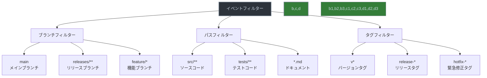

# GitHub Actions のイベントフィルター



> 詳細は[公式ドキュメント: Filter pattern cheat sheet](https://docs.github.com/en/actions/using-workflows/workflow-syntax-for-github-actions#filter-pattern-cheat-sheet)を参照してください。

GitHub Actionsのワークフローをより細かく制御するために、特定の条件に基づいてワークフローの実行を制限することができます。イベントフィルターは、ワークフローの実行を特定の条件に基づいて制限するための重要な設定です。

## ブランチフィルター

`branches`フィルターは、特定のブランチでのみワークフローを実行するために使用されます。

### 基本的な使い方
```yaml
on:
  push:
    branches:
      - main        # メインブランチへのプッシュ時のみ実行
      - 'releases/**' # releases/で始まるブランチへのプッシュ時のみ実行
      - 'feature/*'  # feature/で始まるブランチへのプッシュ時のみ実行
```

### 高度な使い方
```yaml
on:
  pull_request:
    branches:
      - main
      - 'releases/*'
      - '!draft/*'  # draft/で始まるブランチは除外
```

## パスフィルター

`paths`フィルターは、特定のファイルやディレクトリが変更された場合にのみワークフローを実行するために使用されます。

### 基本的な使い方
```yaml
on:
  push:
    paths:
      - 'src/**'    # srcディレクトリ内のファイルが変更された時のみ実行
      - 'tests/**'  # testsディレクトリ内のファイルが変更された時のみ実行
      - '*.md'      # マークダウンファイルが変更された時のみ実行
```

### 高度な使い方
```yaml
on:
  pull_request:
    paths:
      - 'src/**'
      - 'tests/**'
      - '!docs/**'  # docsディレクトリの変更は除外
```

## タグフィルター

`tags`フィルターは、特定のタグが付いた時のみワークフローを実行するために使用されます。

### 基本的な使い方
```yaml
on:
  push:
    tags:
      - 'v*'        # vで始まるタグがプッシュされた時のみ実行
      - 'release-*' # release-で始まるタグがプッシュされた時のみ実行
```

### 高度な使い方
```yaml
on:
  push:
    tags:
      - 'v*'
      - '!v0.*'     # v0で始まるタグは除外
```

## 実践的な使用例

### 開発フローでの使用例
```yaml
name: 開発フロー自動化

on:
  push:
    branches:
      - main
      - develop
    paths:
      - 'src/**'
      - 'tests/**'
      - 'package.json'
      - 'yarn.lock'

  pull_request:
    branches:
      - main
      - develop
    paths:
      - 'src/**'
      - 'tests/**'
      - '!docs/**'

  release:
    types: [published]
    tags:
      - 'v*'
```

## 注意点とベストプラクティス

1. フィルターの組み合わせ
   - 複数のフィルターを組み合わせることで、より細かい制御が可能です
   - ただし、組み合わせが複雑になりすぎないように注意が必要です

2. パスフィルターの特性
   - ファイルの変更を検出しますが、内容の変更は検出しません
   - 大文字小文字を区別します
   - ワイルドカード（`*`、`**`）を使用できます

3. ブランチフィルターの特性
   - プルリクエストの場合は、ベースブランチに基づいて実行を制御します
   - 除外パターン（`!`）を使用できます

4. タグフィルターの特性
   - 正確なタグ名のパターンマッチングを行います
   - セマンティックバージョニングに合わせた設定が推奨されます

5. パフォーマンスへの影響
   - 不要なフィルターは設定しない（パフォーマンスに影響する可能性があります）
   - フィルターの条件は明確に記述する（メンテナンス性の向上）
