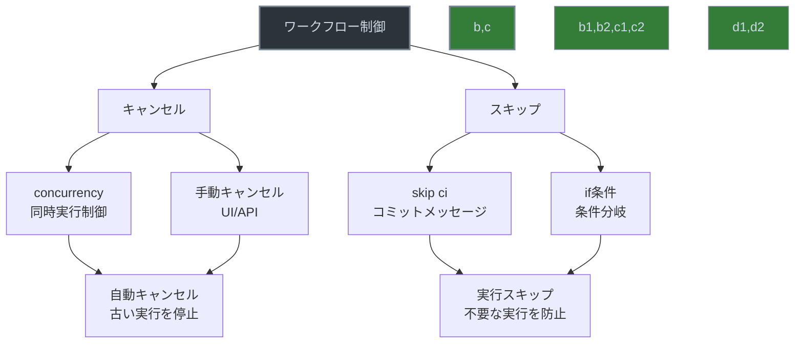

# ワークフローのキャンセルとスキップ



GitHub Actionsのワークフローを効率的に管理するための重要な機能である、ワークフローのキャンセルとスキップについて説明します。

## 概要

ワークフローのキャンセル（Cancelling Workflows）とスキップ（Skip Workflows）は、不要なワークフローの実行を防ぎ、CI/CDパイプラインの効率化を実現する重要な機能です。

## デフォルトの失敗動作

GitHub Actionsでは、以下のような階層的な失敗の伝播がデフォルトで設定されています：

1. ステップの失敗
   - 1つのステップが失敗すると、そのステップを含むジョブ全体が失敗します
   - `continue-on-error: true` で制御可能

2. ジョブの失敗
   - 1つのジョブが失敗すると、そのジョブを含むワークフロー全体が失敗します
   - `if` 条件で制御可能

### 失敗制御の例
```yaml
jobs:
  build:
    runs-on: ubuntu-latest
    steps:
      - name: 失敗する可能性のあるステップ
        continue-on-error: true  # このステップが失敗してもジョブは続行
        run: echo "This might fail"
      
      - name: 条件付きステップ
        if: success()  # 前のステップが成功した場合のみ実行
        run: echo "This runs only if previous step succeeded"
```

## 主要な機能

### 1. ワークフローのキャンセル

#### concurrency（同時実行制御）
```yaml
concurrency:
  group: ${{ github.workflow }}-${{ github.ref }}
  cancel-in-progress: true
```

この設定により：
- 同じブランチやプルリクエストで新しいワークフローが開始された場合
- 実行中の古いワークフローが自動的にキャンセルされます
- リソースの効率的な使用が可能になります

#### 手動キャンセル
- GitHub UIから手動でワークフローをキャンセル可能
- GitHub APIを使用してプログラムでキャンセル可能
- キャンセルされたワークフローは、完了したジョブのステータスを保持

### 2. ワークフローのスキップ

#### コミットメッセージによるスキップ
```bash
# 以下のいずれかの形式でコミットメッセージに記述
git commit -m "Update docs [skip ci]"
git commit -m "Update docs [ci skip]"
git commit -m "Update docs [no ci]"
```

#### 条件によるスキップ
```yaml
jobs:
  build:
    if: |
      github.ref == 'refs/heads/main' &&  # mainブランチの場合のみ
      !contains(github.event.head_commit.message, '[skip ci]')  # スキップ指定がない場合
    runs-on: ubuntu-latest
    steps:
      - name: ビルド
        run: echo "Building..."
```

## 実践的な使用例

### 1. プルリクエストの自動キャンセル
```yaml
name: Pull Request Workflow

on:
  pull_request:
    branches: [ main ]

concurrency:
  group: pr-${{ github.event.pull_request.number }}
  cancel-in-progress: true

jobs:
  test:
    runs-on: ubuntu-latest
    steps:
      - uses: actions/checkout@v3
      - name: Run tests
        run: npm test
```

### 2. 条件付きデプロイ
```yaml
name: Deploy Workflow

on:
  push:
    branches: [ main ]

jobs:
  deploy:
    if: |
      github.ref == 'refs/heads/main' &&
      !contains(github.event.head_commit.message, '[skip deploy]')
    runs-on: ubuntu-latest
    steps:
      - name: Deploy
        run: npm run deploy
```

## ベストプラクティス

1. キャンセル機能の活用
   - 同じブランチへの複数のプッシュがある場合、`concurrency` を使用して古い実行をキャンセル
   - リソースの効率的な使用と、最新の変更のみを処理

2. スキップ機能の活用
   - ドキュメント更新など、CIが不要な変更には `[skip ci]` を使用
   - 特定の条件でのみ実行したい場合は `if` 条件を使用
   - スキップ条件は明確に文書化

3. 失敗制御の最適化
   - 重要なステップは `continue-on-error: false` を明示的に設定
   - 非重要なステップは `continue-on-error: true` で失敗を許容
   - 条件分岐を適切に使用して、柔軟なワークフロー設計を実現

## 公式ドキュメント

- [Concurrency](https://docs.github.com/en/actions/using-workflows/workflow-syntax-for-github-actions#concurrency)
- [Skipping workflow runs](https://docs.github.com/en/actions/managing-workflow-runs/skipping-workflow-runs)
- [Continue on error](https://docs.github.com/en/actions/using-workflows/workflow-syntax-for-github-actions#jobsjob_idstepscontinue-on-error)
