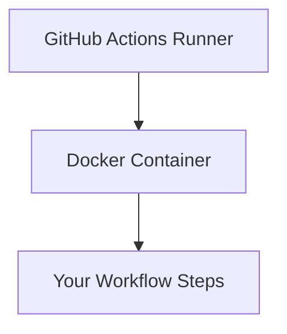

# GitHub Actions のDockerコンテナ

## 概要

GitHub ActionsのジョブでDockerコンテナを使用することで、特定の環境でワークフローを実行できます。コンテナはGitHub Actionsのランナー上で実行されます。

## ランナーとコンテナの関係



- ランナーはワークフローの実行環境を提供
- コンテナはランナー上で実行される
- コンテナを使用しない場合も、ランナー上で直接実行される

## 基本構造

```yaml
jobs:
  container-job:
    # ランナーの指定（必須）
    runs-on: ubuntu-latest
    # コンテナの設定（オプション）
    container:
      image: node:18
      options: --cpus 1
    steps:
      - name: Run in container
        run: node --version
```

## 使用例

### 1. 特定のバージョンのNode.js

```yaml
jobs:
  build:
    # ランナーの指定
    runs-on: ubuntu-latest
    # コンテナの指定
    container:
      image: node:18-alpine
    steps:
      - uses: actions/checkout@v4
      - name: Install dependencies
        run: npm install
      - name: Build
        run: npm run build
```

### 2. カスタムDockerfile

```yaml
jobs:
  custom:
    # ランナーの指定
    runs-on: ubuntu-latest
    # カスタムコンテナの指定
    container:
      image: ${{ github.workspace }}/.github/containers/custom.Dockerfile
      credentials:
        username: ${{ secrets.DOCKER_USERNAME }}
        password: ${{ secrets.DOCKER_PASSWORD }}
```

## 注意点

1. コンテナは必ず`runs-on`で指定したランナー上で実行される
2. コンテナ内のファイルシステムは分離される
3. ポートマッピングが必要な場合は`options`で指定
4. 認証が必要な場合は`credentials`を設定
5. ランナーにDockerがインストールされている必要がある 
