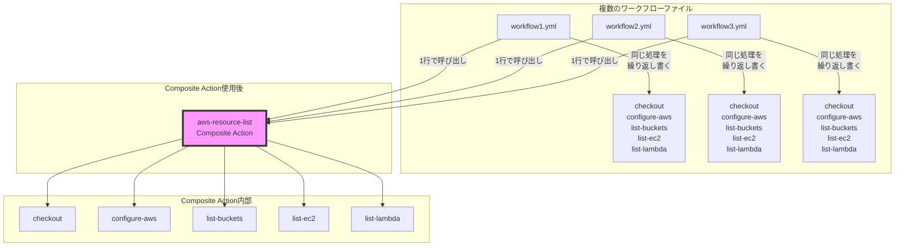

# GitHub Actions Composite Actions

## 概要
Composite Actionsは、複数のステップを1つの再利用可能なアクションとしてまとめることができる機能です。これにより、ワークフローの重複を減らし、メンテナンス性を向上させることができます。

## 主要概念
Composite Actionsは、複数のアクションやシェルコマンドを組み合わせて、1つのカスタムアクションとして定義します。これにより、共通の処理をパッケージ化し、異なるワークフロー間で再利用することが可能になります。

## 視覚化
以下は、Composite Actionを使用することで繰り返しの処理をまとめられる様子を示すmermaid図です：



## 実装例
以下は、AWSリソースの一覧を取得するComposite Actionの例です：

```yaml
# .github/actions/aws-resource-list/action.yml
name: 'AWS Resource List'
description: 'Lists AWS resources (S3, EC2, Lambda)'
inputs:
  aws-region:
    description: 'AWS region to use'
    required: true
    default: 'ap-northeast-1'
runs:
  using: "composite"
  steps:
    - name: checkout
      uses: actions/checkout@v3
    - name: configure-aws
      uses: aws-actions/configure-aws-credentials@v2
      with:
        aws-region: ${{ inputs.aws-region }}
    - name: list-buckets
      run: aws s3 ls
      shell: bash
    - name: list-ec2
      run: aws ec2 describe-instances
      shell: bash
    - name: list-lambda
      run: aws lambda list-functions
      shell: bash
```

このComposite Actionは以下のように使用できます：

```yaml
# .github/workflows/main.yml
name: List AWS Resources
on: [push]
jobs:
  list-resources:
    runs-on: ubuntu-latest
    steps:
      - uses: ./.github/actions/aws-resource-list
        with:
          aws-region: 'ap-northeast-1'
```

## セキュリティ考慮事項
- Composite Action内で使用するアクションは、可能な限り固定バージョン（例：`@v3`）を指定する
- 機密情報は必ずGitHub Secretsを使用し、直接ハードコードしない
- サードパーティのアクションを使用する場合は、信頼できるソースからのものであることを確認する

## 参考資料
- [GitHub Actions公式ドキュメント - Composite Actions](https://docs.github.com/ja/actions/creating-actions/creating-a-composite-action)
- [GitHub Actionsのベストプラクティス](https://docs.github.com/ja/actions/learn-github-actions/security-hardening-for-github-actions)
