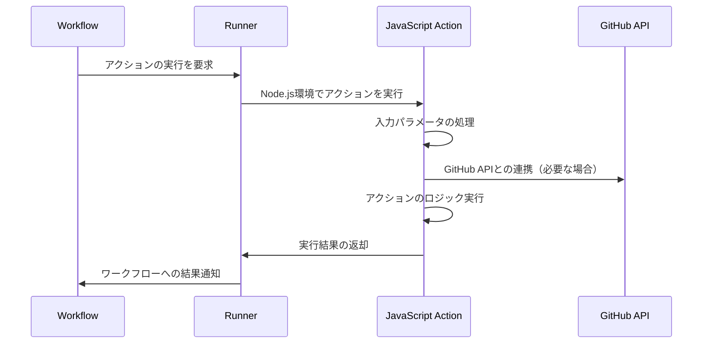

# JavaScript Actions

GitHub ActionsでJavaScriptを使用したカスタムアクションの作成方法について説明します。JavaScriptアクションは、Node.jsのエコシステムを活用して、柔軟で再利用可能なワークフローコンポーネントを作成するための重要な方法です。

## 主要概念

JavaScriptアクションは、Node.jsのモジュールとして実装され、`action.yml`（または`action.yaml`）ファイルで定義されます。これにより、TypeScriptやJavaScriptの豊富なエコシステムを活用しながら、GitHub Actionsのワークフローに統合可能な再利用可能なコンポーネントを作成できます。

## 推奨パッケージ

JavaScriptアクションの開発をより効率的に行うために、以下のパッケージの使用をお勧めします：

```bash
npm install @actions/core @actions/github @actions/exec
```

### 各パッケージの利点

これらのパッケージは必須ではありませんが、GitHub Actionsの開発をより簡単で安全にするための便利な機能を提供します：

1. `@actions/core`の利点：
   - ワークフローとの標準化されたインターフェースを提供
   - 環境変数やシークレットへの安全なアクセス方法を提供
   - ワークフローの実行状態（成功/失敗）を簡単に制御
   - アクション間でのデータ受け渡しを標準化

2. `@actions/github`の利点：
   - GitHub APIへの簡単なアクセスを提供
   - ワークフローの実行コンテキスト（リポジトリ情報、イベント情報など）への便利なアクセス
   - GitHubの認証情報を自動的に管理
   - APIレート制限の適切な処理

3. `@actions/exec`の利点：
   - シェルコマンドの実行を簡単に制御
   - クロスプラットフォーム（Windows/Linux/macOS）での一貫した動作を保証
   - コマンドの実行結果やエラーを適切に処理
   - 非同期実行のサポート

各パッケージの主な機能：

- `@actions/core`: GitHub Actionsのワークフローとのインターフェースを提供
  - 入力パラメータの取得（`getInput`）
  - 出力値の設定（`setOutput`）
  - ログ出力（`info`, `warning`, `error`）
  - 機密情報の保護（`setSecret`）
  - アクションの成功/失敗の設定（`setFailed`）

- `@actions/github`: GitHub APIとの連携を提供
  - リポジトリ情報の取得
  - IssueやPull Requestの操作
  - ワークフローコンテキストへのアクセス

- `@actions/exec`: シェルコマンドの実行を提供
  - 外部コマンドの実行
  - 実行結果の取得
  - エラーハンドリング

## 実装例

以下は、シンプルなJavaScriptアクションの実装例です：

```javascript
// action.js
const core = require('@actions/core');
const github = require('@actions/github');
const exec = require('@actions/exec');

try {
  // 入力パラメータの取得
  const nameToGreet = core.getInput('who-to-greet');
  
  // 現在時刻の取得
  const time = (new Date()).toTimeString();
  
  // 出力の設定
  core.setOutput("time", time);
  
  // ログの出力
  console.log(`Hello ${nameToGreet}!`);
  console.log(`The time was ${time}`);

  // GitHubコンテキストの使用例
  const context = github.context;
  console.log(`Running in repository: ${context.repo.owner}/${context.repo.repo}`);

  // シェルコマンドの実行例
  await exec.exec('echo', ['Hello from shell command']);
} catch (error) {
  core.setFailed(error.message);
}
```

対応する`action.yml`ファイル：

```yaml
name: 'Hello World'
description: 'Greet someone and record the time'
inputs:
  who-to-greet:
    description: 'Who to greet'
    required: true
    default: 'World'
outputs:
  time:
    description: "The time we greeted you"
runs:
  using: "node12"
  main: "action.js"
```

## 視覚的な説明

以下は、JavaScriptアクションの実行フローを示す図です：



## セキュリティの考慮事項

- 入力パラメータは必ず検証し、適切なサニタイズを行う
- 機密情報は`@actions/core`の`setSecret`を使用して保護する
- 依存パッケージは定期的に更新し、セキュリティ脆弱性に対応する
- シェルコマンドを実行する際は、入力値のサニタイズを徹底する

## 参考資料

- [GitHub Actions のドキュメント](https://docs.github.com/ja/actions/creating-actions/creating-a-javascript-action)
- [@actions/core パッケージ](https://github.com/actions/toolkit/tree/main/packages/core)
- [@actions/github パッケージ](https://github.com/actions/toolkit/tree/main/packages/github)
- [@actions/exec パッケージ](https://github.com/actions/toolkit/tree/main/packages/exec)
- [GitHub Actions のベストプラクティス](https://docs.github.com/ja/actions/learn-github-actions/security-hardening-for-github-actions)
