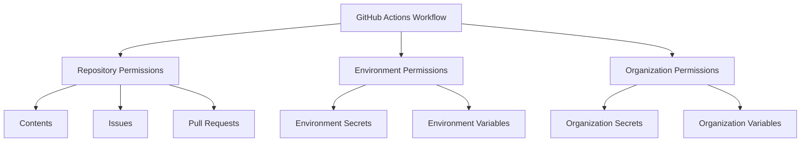
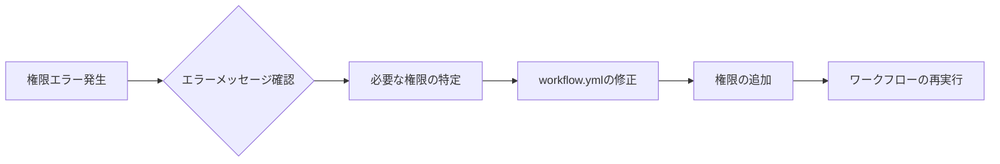

# GitHub Actionsの権限問題とその解決方法

GitHub Actionsの権限問題は、ワークフローの実行時に発生する一般的な課題であり、適切な権限設定がセキュリティと機能性の両方に影響を与えます。

## 主要な権限の概念

GitHub Actionsでは、`permissions`キーを使用して、ワークフローが実行できる操作を制限できます。これにより、最小権限の原則に基づいた安全なワークフロー実行が可能になります。

## 一般的な権限問題と解決策

### 1. リポジトリへのアクセス権限

```yaml
permissions:
  contents: read    # リポジトリのコンテンツ読み取り
  issues: write     # イシューの作成・更新
  pull-requests: write  # プルリクエストの作成・更新
```

### 2. 環境変数へのアクセス

```yaml
jobs:
  build:
    runs-on: ubuntu-latest
    environment: production
    env:
      MY_SECRET: ${{ secrets.MY_SECRET }}
```

## 権限の階層構造



## セキュリティのベストプラクティス

1. 最小権限の原則に従う
2. 機密情報は必ず`secrets`として保存
3. 環境ごとに適切な権限を設定
4. 定期的な権限の見直しと監査

## トラブルシューティング

一般的な権限エラーの解決手順：



## 参考資料

- [GitHub Actionsの権限設定ドキュメント](https://docs.github.com/ja/actions/using-jobs/assigning-permissions-to-jobs)
- [GitHub Actionsのセキュリティベストプラクティス](https://docs.github.com/ja/actions/security-guides/security-hardening-for-github-actions)
- https://zenn.dev/not75743/scraps/926f2693809744
