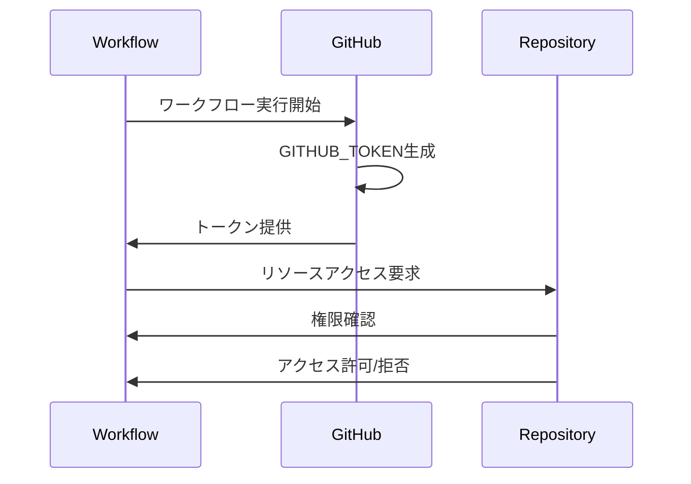

# GitHub Token

## 概要
GitHub Tokenは、GitHub Actionsのワークフロー内でGitHubのリソースにアクセスするための認証メカニズムです。セキュアな方法でリポジトリやパッケージへのアクセスを制御するために重要な役割を果たします。

## 主要概念
GitHub Tokenは、ワークフロー実行時に自動的に生成される一時的なトークンで、`GITHUB_TOKEN`というシークレットとして利用可能です。このトークンは、ワークフローの実行コンテキストに基づいて適切な権限が付与され、最小権限の原則に従って設計されています。

## 実装例
```yaml
name: Example Workflow
on: [push]

jobs:
  example:
    runs-on: ubuntu-latest
    steps:
      - name: Checkout repository
        uses: actions/checkout@v3
        with:
          token: ${{ secrets.GITHUB_TOKEN }}
      
      - name: Create Pull Request
        uses: peter-evans/create-pull-request@v4
        with:
          token: ${{ secrets.GITHUB_TOKEN }}
```

## 権限の設定
GitHub Tokenの権限は、ワークフローファイル内で明示的に設定できます：

```yaml
permissions:
  contents: read    # リポジトリのコンテンツへの読み取り権限
  pull-requests: write  # プルリクエストへの書き込み権限
```

## セキュリティ上の考慮事項
- GitHub Tokenは自動的にワークフロー実行時に生成され、実行終了後に無効化されます
- デフォルトでは最小権限が付与されており、必要に応じて明示的に権限を付与する必要があります
- フォークされたリポジトリからのワークフロー実行時は、特別な権限設定が必要な場合があります

## 関連プロセスの視覚化



## 参考資料
- [GitHub Actionsの認証](https://docs.github.com/ja/actions/security-guides/automatic-token-authentication)
- [GitHub Tokenの権限設定](https://docs.github.com/ja/actions/using-jobs/assigning-permissions-to-jobs)
